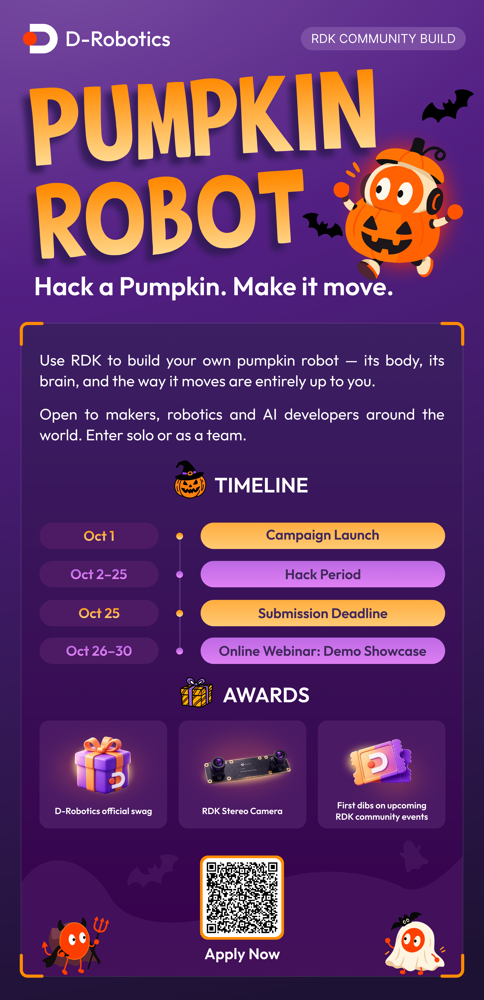

# Pumpkin Robot Challenge

[Register](https://docs.google.com/forms/d/e/1FAIpQLSfuGT52LJ6RNDt2Abgb-7JMta5jRFOFBrk_4JrWJK3iXJwx9w/viewform?usp=publish-editor) · [Submission Guide](SUBMISSION-GUIDE.md) · [Project Template](PROJECT-TEMPLATE.md) · [Project Gallery](projects/README.md)

  

## Hack a pumpkin. Make it move.

A pumpkin. An RDK X5. Something that moves.

Build a robot around a real pumpkin, a carved shell, a 3D-printed body, or your own interpretation of one. Make it walk, roll, spin, gesture, talk, react, follow, avoid obstacles, or do something we have not thought of yet.

The form is open. The three requirements are not:

- **Use an RDK X5** for a meaningful part of the system.
- **Make the pumpkin recognizable** in the physical build or interaction.
- **Create physical movement** that is visible in the final demo.

A stock demo in a pumpkin-shaped enclosure is a starting point, not a finished entry. Show us the engineering you added: perception, control, interaction, mechanical design, system integration, or a combination of them.

## Dates

| Date | What happens |
| --- | --- |
| **Oct 1** | Campaign launch |
| **Oct 2–25** | Hack period |
| **Oct 25** | Submission deadline |
| **Oct 26–30** | Community demo showcase |

## How submissions work

This challenge follows the same contribution model as the Robotics Dream Keeper Challenge: your code stays in your own repository, while this repository collects one project profile per entry.

1. [Register for the challenge](https://docs.google.com/forms/d/e/1FAIpQLSfuGT52LJ6RNDt2Abgb-7JMta5jRFOFBrk_4JrWJK3iXJwx9w/viewform?usp=publish-editor).
2. Build and document the project in your own GitHub repository, either solo or as a team.
3. Record a demo video that shows the complete robot moving and demonstrates its main interaction or AI feature.
4. Fork `D-Robotics/RDK-Community-Build`.
5. Add a project profile under [`Pumpkin-Robot-Challenge/projects/`](projects/README.md) using the [Project Template](PROJECT-TEMPLATE.md).
6. Open a pull request. Maintainers review the links and project fit, then merge the profile into the gallery.

We merge the project profile, not the source code. You keep ownership and maintenance of your project repository.

Progress posts are welcome, especially the messy parts: early sketches, failed mechanisms, first movement, tuning sessions, and fixes that made the final build work.

## What to submit

You need two external links and one pull request:

- **Project repository** — public or accessible to reviewers, owned by you or your team.
- **Demo video** — a clear recording of the finished robot in action.
- **Showcase pull request** — a Markdown project profile added under `Pumpkin-Robot-Challenge/projects/`.

Your repository should answer the questions another developer will ask:

- What does it do?
- What runs on the RDK X5?
- How are the sensors, actuators, and software components connected?
- How do I build and run it?
- What parts did you use?
- What worked, what did not, and what would you change next?

A solid project README usually includes a short overview, demo media, features, bill of materials, system architecture, setup instructions, source code, known limitations, and a license. Use the [Project Template](PROJECT-TEMPLATE.md) if you want a starting structure.

## Need an idea?

- A walking jack-o'-lantern that tracks faces or follows a person.
- A wheeled pumpkin that patrols a room and reacts to visitors.
- A talking pumpkin with local speech recognition and animated movement.
- A pumpkin turret that follows sound or motion without launching anything.
- A balancing, dancing, drawing, or instrument-playing pumpkin.
- A small swarm of pumpkins that coordinate over the network.

Simple is fine if it is well built. A reliable two-wheel robot with clean control and good documentation is more useful than an ambitious demo nobody can reproduce.

## RDK resources

- [D-Robotics Developer Center](https://developer.d-robotics.cc/rdk_doc_center/)
- [RDK documentation](https://github.com/D-Robotics/rdk_doc)
- [RDK Model Zoo](https://github.com/D-Robotics/rdk_model_zoo)
- `#pumpkin-robot` on the D-Robotics Discord server

## Project gallery

Reviewed entries will be added to the [Pumpkin Robot project gallery](projects/README.md).
